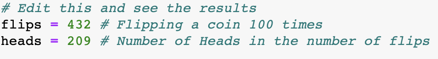
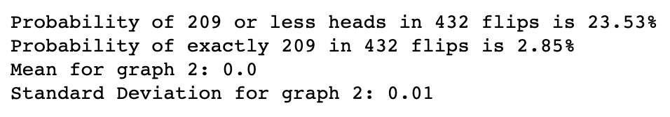

# Coin_flip_probabilities

I created this project to find out the probability of flipping a certain number of heads with a certain total number of flips.

To better explain the project, let me use an example. If you flipped a coin 100 times, and there were 100 heads, then obviously 
the coin is biased. Same thing with 99, and 98 heads. On, the other hand, if the coin was heads 50 or 51 times, we would consider
that coin fair. The question I wanted to answer was how many heads would the coin be considered fair or biased. 

To answer this question, I used the binomial distribution to calculate the probability of getting k successes of heads given n flips.
I also used a Cumulative Distribution Function to determine the probability of k or less successes. 

Here is an example:

I then graphed out the binomial distribution:

Then the Cumulative Distribution Function:

With this, I was able to determine whether or not the coin was fair or not: 

You can now try this with any number of flips and heads. It will graph both the binomial distribution and Cumulative Distribution Function. With this, you will be able to determine if any coin is biased or not using probability.

